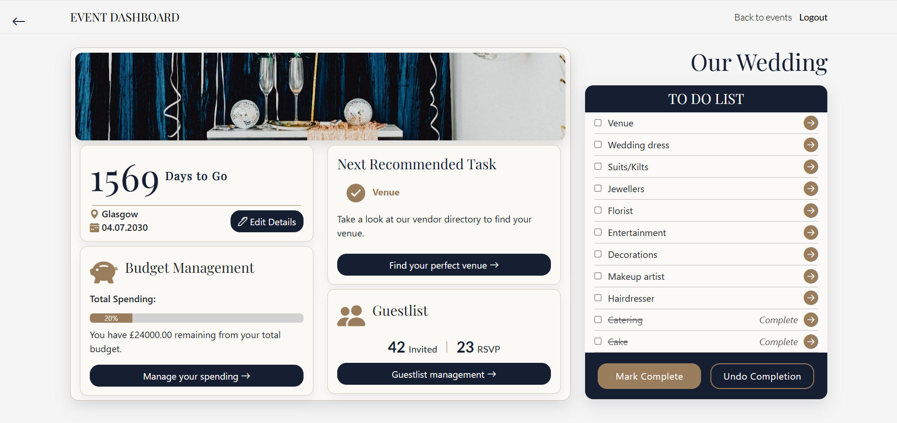
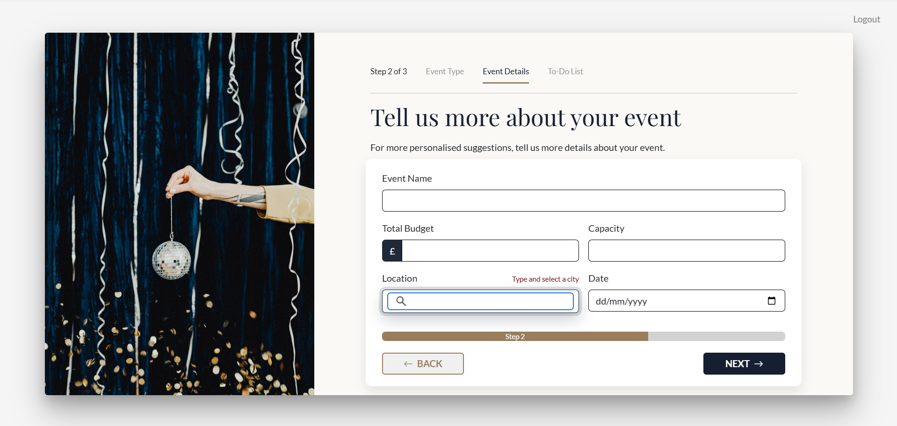
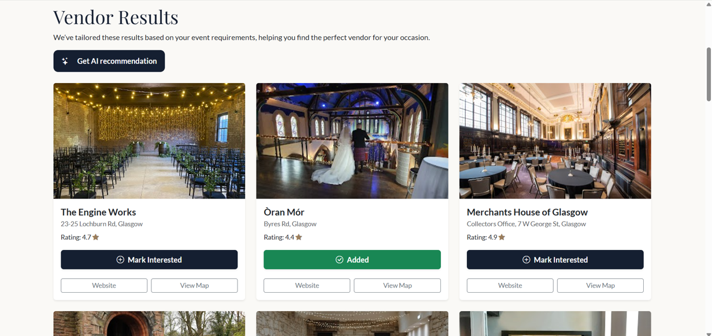
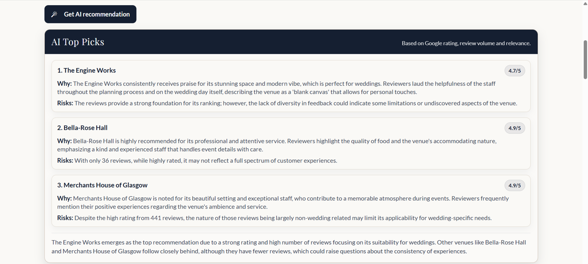
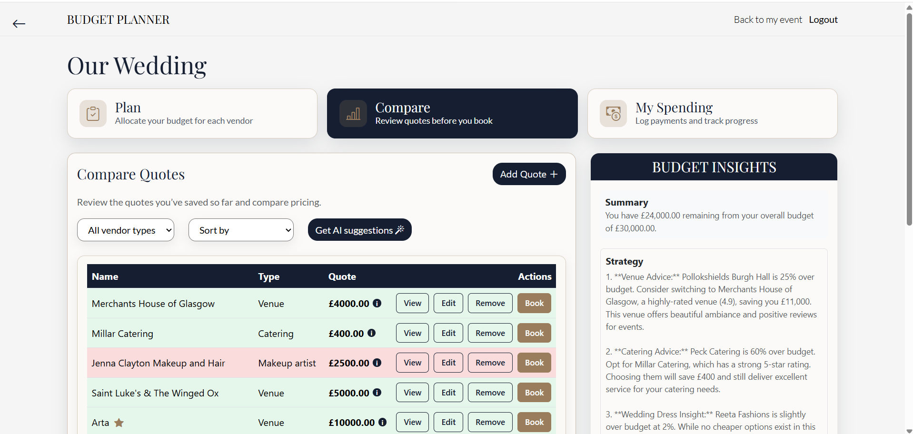
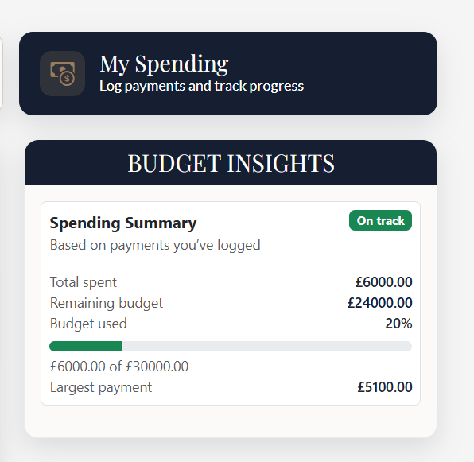
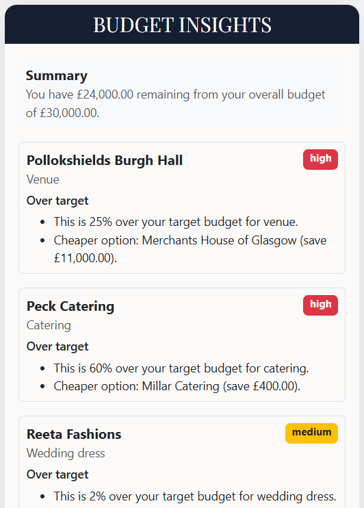

# Event Planning Flask Web Application

## Overview
This project is a data-driven event planning system designed to help users organise and manage a range of events through recommended planning steps, a personal vendor directory, and a budget management system.

## Features
- Create and manage events
- Recommended event planning to-do list
- Personal vendor directory powered by the Google Places API
- Budget management with visual alerts and spending suggestions
- AI-generated vendor suitability ranking based on Google reviews and the user's event requirements
- AI-driven spending recommendations based on current spending patterns and vendor review data

## Technology Stack
Frontend Development: HTML5, CSS, JavaScript  
Server-Side Language: Python  
Framework: Flask  
Templating Engine: Jinja  
Database: MySQL  
Python Libraries: WTForms, SQLAlchemy  
API Integrations: Auth0, Google Maps API, Google Places API, OpenAI API  

## Project Status
This application is currently under active development and additional features are still being implemented.

## Screenshots
### Event Dashboard

### Create New Event

### Vendor Directory

### Vendor Recommendations

### Budget Insights

### Spending Insights

### Vendor Comparison

